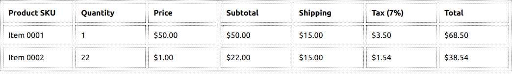

# React/Redux/Typescript Coding Challenge

This challenge is intended to test React, Redux, Typescript skills.
Please read through the scenario completely, architect your solution, and complete it to the best of your abilities using the time allotted. 

## Scenario & Design Specification

You've just attended a feature handoff meeting from the Design team, and you've been tasked with building out a new component which takes an array of product data and displays it in a table (row/column) layout.

The resulting table component will need to take each row's Quantity, Price, and Shipping fields and use them into calculate a Subtotal, Tax, and Total field for each row. Use Redux to manage the state of the table.

The Quantity and Price fields should be user editable. None of the other fields such as Shipping need to be editable at this time, but that would be a bonus if time allows.

The Design team has provided the following mockup to demonstrate what the table should look like. The editable cells mentioned above are not shown in the mockup.

For your convience, a sample dataset has been provided in the `src/data/product_data.ts` file.

## Available Commands

In the project directory, you can run:

- `yarn start` to open the app in development mode with hot reload support.
- `yarn test` launches the test runner.
